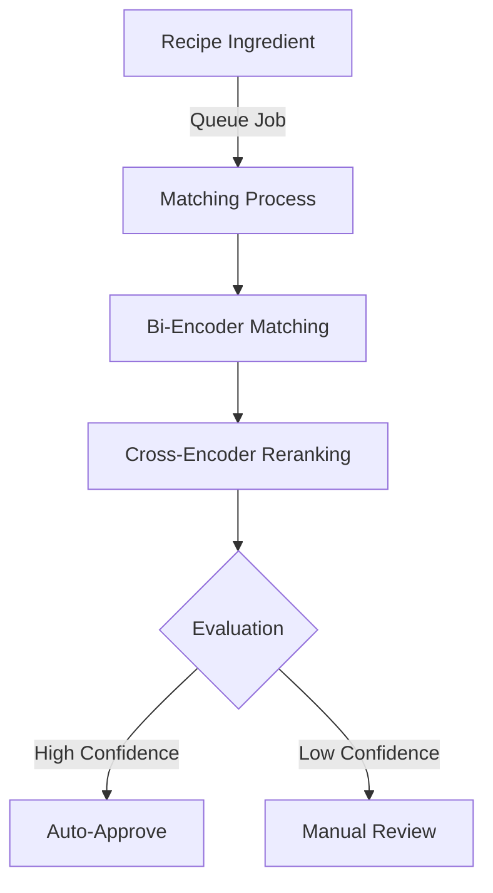
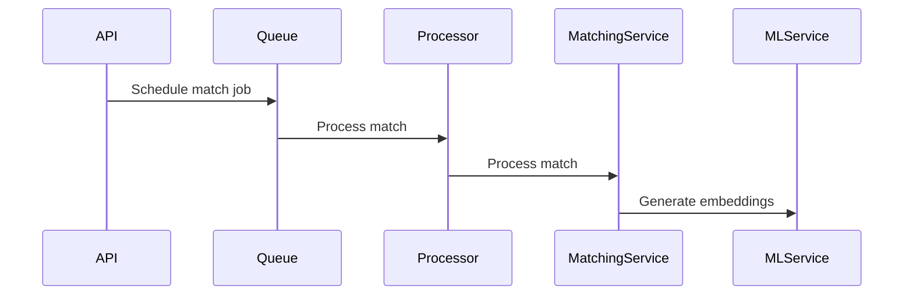
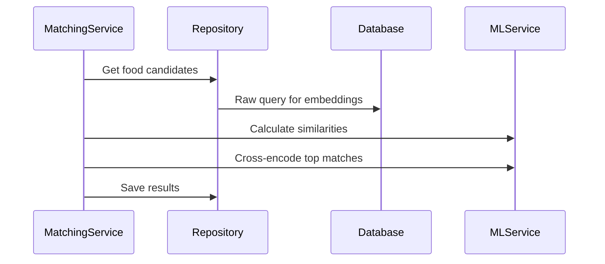
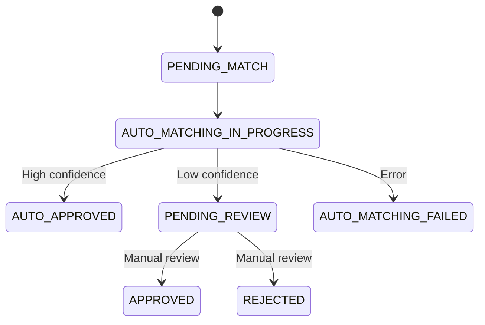

# Ingredient Matching System V1 Documentation 

## System Overview

The ingredient matching system is designed to automatically match recipe ingredients with standardized food items from a database. It employs a two-stage matching process using bi-encoder and cross-encoder models for optimal accuracy.

## Architecture Components

### 1. ML Module (`@nutri/server/ml`)
- Core ML operations for embedding generation and similarity scoring
- Handles model lifecycle (initialization, inference, cleanup)
- Provides both bi-encoder and cross-encoder capabilities

### 2. Ingredient Matching Module (`@nutri/server/ingredient-matching`)
- Business logic for the matching process
- Database operations for matches and foods
- Queue processing and job scheduling
- API endpoints (REST & GraphQL)

### 3. Queue Module (`@nutri/server/queue`)
- Queue infrastructure using BullMQ
- Job scheduling and processing
- Error handling and retries
- Monitoring and metrics

## Machine Learning Components

### Bi-Encoder
- **Purpose**: Initial candidate retrieval
- **How it works**: Generates dense vector embeddings for both ingredient text and food items
- **Advantages**: 
  - Fast similarity search
  - Efficient for large-scale retrieval
  - Can be used with vector databases
- **Output**: Initial ranked list of potential matches

### Cross-Encoder
- **Purpose**: Re-ranking of top candidates
- **How it works**: Takes pairs of texts (ingredient + food item) and produces similarity scores
- **Advantages**:
  - More accurate than bi-encoder for direct comparisons
  - Better at understanding contextual relationships
- **Limitations**:
  - Computationally expensive
  - Can only compare pairs (no embedding generation)

## Matching Process Flow

1. **Job Creation**

2. **Matching Process**

3. **Status Management**

## Database Schema

Key tables involved:
- `matches`: Stores matching attempts and their status
- `match_foods`: Stores potential matches and their scores
- `food_embeddings`: Stores pre-computed embeddings for foods
- `foods`: Standard food database
- `recipe_ingredients`: Recipe ingredients to be matched

## Quality Evaluation

Match quality is determined by:
1. Bi-encoder similarity score
2. Cross-encoder verification score
3. Configurable thresholds for different quality levels:
   - EXACT: > 0.95
   - HIGH: > 0.85
   - MEDIUM: > 0.75
   - LOW: > 0.60
   - POOR: < 0.60

## Error Handling

- Custom error types for different failure scenarios
- Automatic retries with exponential backoff
- Status tracking for failed matches
- Logging and monitoring integration

## Monitoring & Metrics

- Queue statistics (active, completed, failed jobs)
- Processing time measurements
- Match quality distribution
- Error rate tracking

## Current Limitations

1. Relies heavily on text similarity
2. Limited understanding of context
3. No handling of ingredient quantities and units
4. No consideration of recipe context
5. Limited semantic understanding of ingredients
