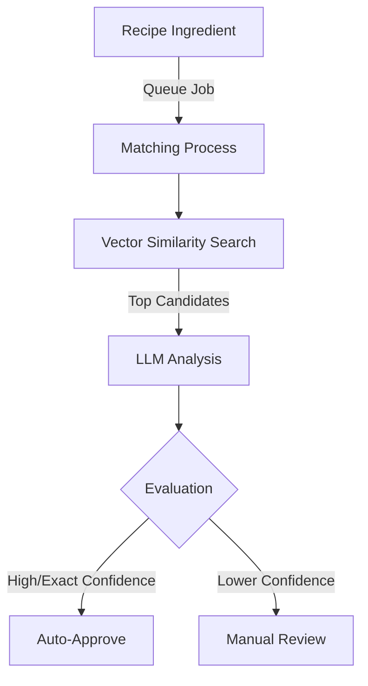
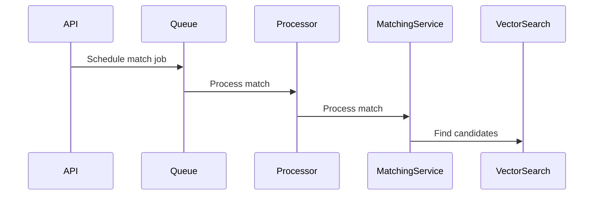
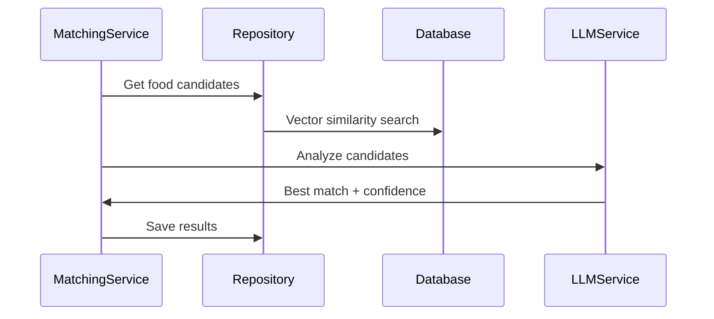
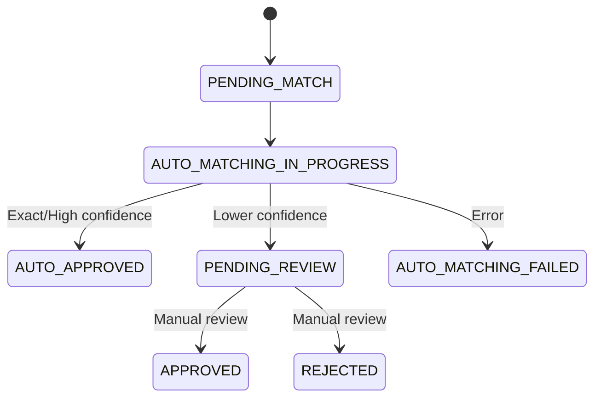

# Ingredient Matching System V2 Documentation 

## System Overview

The ingredient matching system automatically matches recipe ingredients with standardized food items from a database. It uses a combination of vector similarity search and Large Language Model (LLM) analysis for optimal accuracy.



## Architecture Components

### 1. ML Module (`@nutri/server/ml`)
- Embedding generation using all-MiniLM-L6-v2 model
- LLM interface for intelligent matching using Llama-3.2-3b-instruct
- Vector similarity calculations
- Model lifecycle management

### 2. Ingredient Matching Module (`@nutri/server/ingredient-matching`)
- Business logic for the matching process
- Database operations for matches and foods
- Queue processing and job scheduling
- API endpoints (REST & GraphQL)

### 3. Queue Module (`@nutri/server/queue`)
- Queue infrastructure using BullMQ
- Job scheduling and processing
- Error handling and retries
- Exponential backoff retry strategy

## Matching Components

### Vector Similarity Search
- **Purpose**: Initial candidate retrieval
- **Model**: all-MiniLM-L6-v2 (384-dimensional embeddings)
- **Implementation**: PostgreSQL with pgvector extension
- **Advantages**: 
  - Fast similarity search
  - Efficient for large-scale retrieval
  - Indexed database queries
- **Output**: Top N similar candidates

### LLM Analysis (Llama-3.2-3b-instruct)
- **Purpose**: Intelligent matching and confidence scoring
- **How it works**: Analyzes ingredient text and candidate matches to determine best match
- **Advantages**:
  - Context-aware matching
  - Detailed reasoning for matches
  - Confidence level assessment
- **Output**: Best match with confidence level and reasoning

## Matching Process Flow

1. **Job Creation**


2. **Matching Process**


3. **Status Management**


## Database Schema

Key tables involved:
- `matches`: Stores matching attempts and their status
- `match_foods`: Stores potential matches and their scores
- `food_embeddings`: Stores pre-computed embeddings for foods
- `foods`: Standard food database
- `recipe_ingredients`: Recipe ingredients to be matched

## Quality Evaluation

Match quality is determined by LLM analysis with five confidence levels:
- **EXACT**: Perfect match with identical meaning
- **HIGH**: Very close match with minor differences
- **MEDIUM**: Reasonable match with some differences
- **LOW**: Possible match but significant differences
- **POOR**: Match exists but not recommended

## Error Handling

- Custom error types for different failure scenarios
- Automatic retries with exponential backoff
- Status tracking for failed matches
- Comprehensive logging with context

## API Endpoints

### REST API
```
POST /api/ingredient-matching/schedule
POST /api/ingredient-matching/execute
```

### GraphQL
```graphql
mutation ScheduleIngredientMatch($input: ScheduleMatchInput!)
mutation ExecuteIngredientMatch($input: ExecuteMatchInput!)
```

## Current Capabilities and Limitations

### Capabilities
1. Efficient vector similarity search
2. Context-aware matching through LLM
3. Detailed match reasoning
4. Confidence-based auto-approval
5. Immediate or queued processing

### Limitations
1. LLM response quality depends on model size
2. No handling of ingredient quantities
3. No consideration of recipe context
4. Model size vs speed trade-offs
5. Requires pre-computed embeddings

## Future Improvements

1. Upgrade to larger language models
2. Add recipe context consideration
